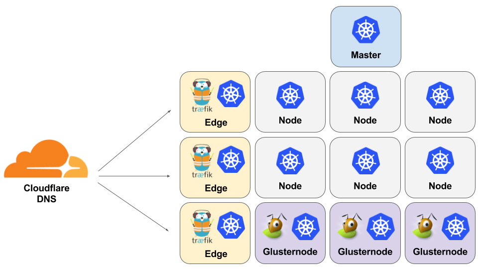

Men Jag vill ha in den här

Using KubeNow you can rapidly deploy, scale, and tear down your Kubernetes clusters on AWS, GCE and OpenStack.

## Table of Contents

- [Approach](#approach)
- [Architecture](#architecture)
- [Getting Started](#getting-started)
- [Roadmap](#roadmap)

## Approach
Rather than providing an all-in-one tool for provisioning a Kubernetes cluster (e.g. [Juju](https://jujucharms.com/) and [Kubespray](https://github.com/kubespray/kargo-cli)), KubeNow comes as a thin layer on top of [Terraform](https://www.terraform.io/), [Packer](https://www.packer.io/), [Ansible](https://www.ansible.com/) and [kubeadm](http://kubernetes.io/docs/getting-started-guides/kubeadm). Following this approach we aim to provide a simple, light-weight, tool for Kubernetes provisioning, while making DevOps transparent and fun.

## Architecture
Deploying a KubeNow cluster you will get:

 - A Kubernetes cluster up and running in less than 10 minutes (provisioned with [kubeadm](http://kubernetes.io/docs/getting-started-guides/kubeadm/))
 - [Weave](https://www.weave.works/) networking
 - [Traefik](https://traefik.io/) HTTP reverse proxy and load balancer
 - [Cloudflare](https://www.cloudflare.com/) dynamic DNS integration
 - [GlusterFS](https://www.gluster.org/) distributed file system

This kind of deployment is particularly convenient, as only the master node, and the **edge nodes** (that run [Traefik](https://traefik.io/)) need to be associated to public IPs (which can be scarce). Therefore, the end user will access the microservices running in the **Kubernetes nodes**, through a **edge node** that will act as a reverse proxy. The DNS service will loadbalance the requests over the edge nodes.

## Getting started

Want to try KubeNow? You can get started following the tutorials in the documentation:

## Roadmap

### Core
- [x] Kubernetes
- [ ] High Availability
- [ ] Scaling (it lacks documentation, but it should work)
- [ ] Autoscaling
- [ ] Dashboard

### Cloud Providers
- [x] OpenStack
- [x] Google Cloud Platform
- [x] Amazon Web Services
- [ ] Local
- [ ] Bare Metal

### Load balancer
- [x] Traefik

### Networking
- [x] Weave

### Big Data Frameworks
- [ ] Spark

### Storage
- [x] GlusterFS
